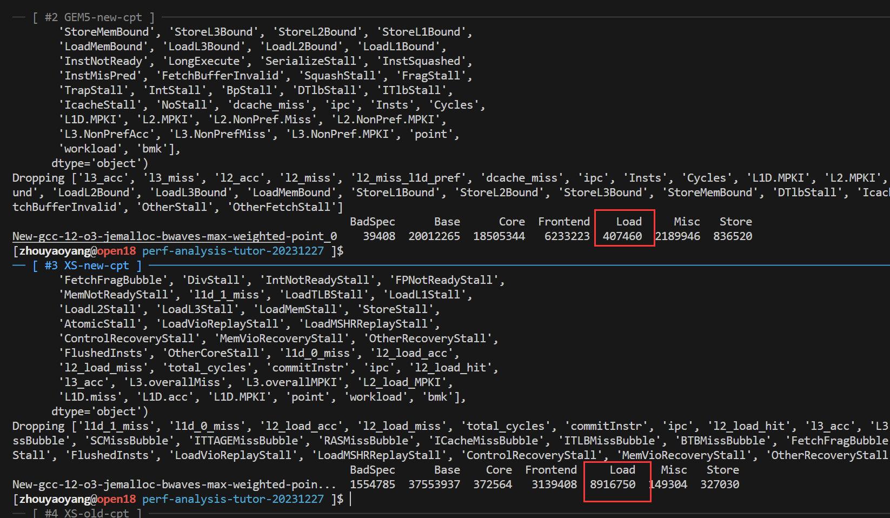
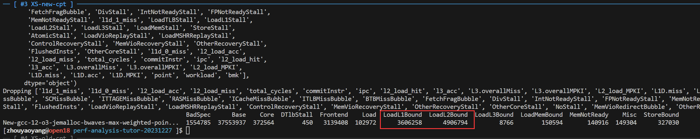
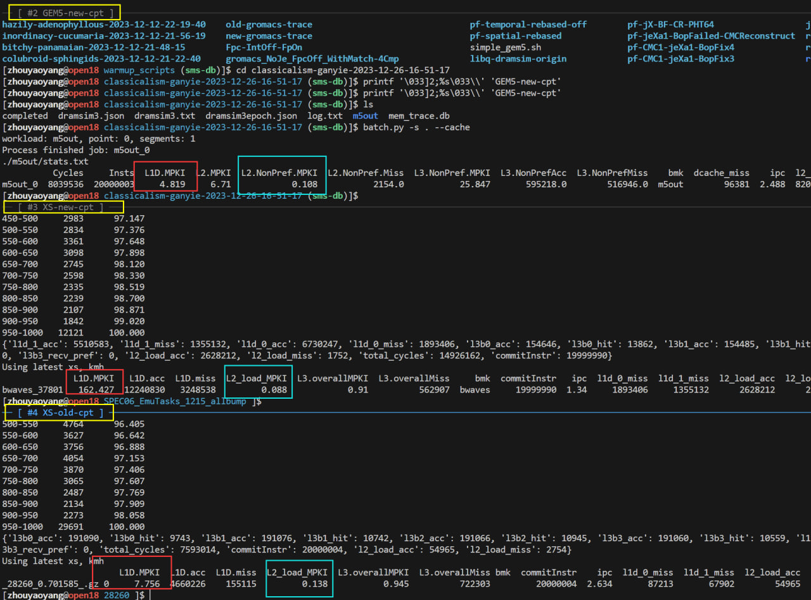
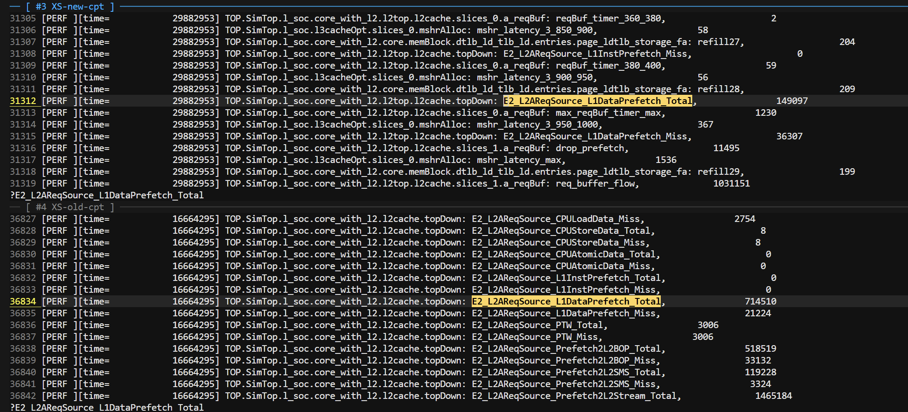

# bwaves 性能异常

在2023年12月的一次RTL性能测试中，我们发现bwaves的性能下降了30%。

## 直觉

本次测试与上次测试相比，我们已知的主要差异是SPECCPU06的编译选项和内存库发生了变化。
其中，我们对浮点应用的编译选项进行了调整，-ffp-contraction=fast（默认选项），该选项
会影响FMA指令的生成。
在GEM5上，我们同样观察到了性能下降（8%），因此我的第一反应是这是由于FMA导致的。

## 分析所需数据和脚本

样例数据获取：
- 公网链接：https://smailnjueducn-my.sharepoint.com/personal/shinezyy_smail_nju_edu_cn/_layouts/15/onedrive.aspx?id=%2Fpersonal%2Fshinezyy%5Fsmail%5Fnju%5Fedu%5Fcn%2FDocuments%2Fperf%2Danalysis%2Dtutor%2D20231227&ga=1
- BOSC 内部路径：/nfs-nvme/home/share/zyy/perf-analysis-tutor-20231227

我们假设数据下载目录是 `tutor_top`

拷贝数据分析所用脚本：
``` Bash
git clone https://github.com/shinezyy/gem5_data_proc.git -b tutor-20231228
```
将脚本根本根目录加入到PATH

## 分析过程

但是直觉不一定靠谱，遵循我们的方法论，第一步我在新版本的软件checkpoint上对GEM5和RTL
进行了topdown 分析。
我们在 `$tutor_top` 目录分别执行如下命令来得到RTL和GEM5的topdown数据：
``` Bash
batch.py -s . --cache -X -F New-gcc-12-o3-jemalloc-bwaves-max-weighted-point-XS-RTL -t
```

如下图所示，虽然topdown计数器年久失修，导致很多计数器不对劲（比如RTL的Base居然不是20M），但是可以看出RTL的LoadBound大幅多于GEM5。


对LoadBound进行拆解，我们发现RTL的LoadBound主要来自于L1DBound和L2Bound。注意，L2Bound增多意味着L1 miss增多。


然后我们对Cache miss进行分析
``` Bash
batch.py -s . --cache -F New-gcc-12-o3-jemalloc-bwaves-max-weighted-point
batch.py -s . --cache -X -F New-gcc-12-o3-jemalloc-bwaves-max-weighted-point-XS-RTL --cache
```
发现L2 MPKI几乎没有区别，而L1的MPKI有2个数量级的差别。
并且，我们还对比了上一个版本的RTL的计数器，发现L1的MPKI很低，与GEM5接近。因此我们几乎可以确定问题出在L1 cache的替换或者预取。




最后，我们发现，上一个版本的RTL发出的L1 预取数量是新版本的5倍，因此它大概率是性能倒退的来源。

